# Horizon Tech

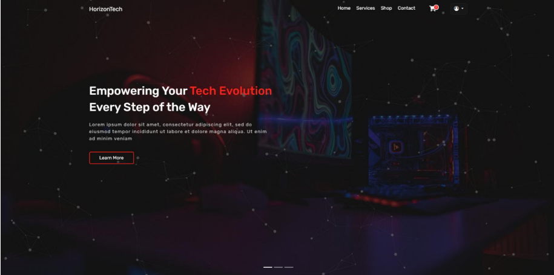
In this project, we developed a web application aimed at enhancing user
experience and streamlining specific tasks related to the online sale of computer
peripherals, including keyboards, headphones, and CPUs. The application was built
using a modern tech stack including HTML, CSS, JavaScript, and PHP for the
backend. Our primary objective was to create a responsive, user-friendly interface
that allows users to efficiently manage their tasks and track their progress. We
employed an iterative development process. Key features of the application include
user authentication, real-time data synchronization, and customizable dashboards.
Through this project, we gained valuable experience in full-stack development and
improved our skills in collaborative coding and project management. The final
product is a fully functional online store that showcases our ability to develop and
deploy a comprehensive e-commerce platform, providing a solid foundation for
future work and further enhancements

## Introducion

Welcome to our innovative web application dedicated to enriching the online
shopping experience for computer peripherals, ensuring a seamless and efficient
journey for all tech enthusiasts. In today’s digital age, where the demand for highperformance computing components like keyboards, headphones, and CPUs
continues to rise, our platform aims to serve as a trusted hub for discovering and
acquiring these essential tools with ease and confidence.
Our mission is rooted in simplifying the process of finding and purchasing computer
peripherals. We provide a meticulously curated selection of products, meticulously
vetted for quality and performance, accompanied by comprehensive specifications
and user reviews. Whether you're a professional seeking cutting-edge hardware or
an enthusiast upgrading your setup, our user-friendly interface is designed to
facilitate informed decision-making.
At the core of our platform is a commitment to user satisfaction and convenience.
We understand the challenges of navigating through a myriad of options and aim
to streamline your shopping experience. Join us in embracing the convenience and
assurance of online shopping, where securing your ideal computer peripherals is
not just efficient but also enjoyable.

## Project Requirements

The company tracks orders, each identified by a unique id, associated with a user
(user_id as a foreign key), and records whether the order is complete
(is_complete), the date the order was placed (date_order), and the delivery
address (address). Categories are defined with a unique id, a name, and a
description.
Order details are stored in the order_product table, which includes a unique id, and
foreign keys to the order (order_id), product (product_id), and user (user_id), along
with the quantity ordered (quantity).
Reviews are tracked with a unique id, and include the user (user_id as a foreign
key) and product (product_id as a foreign key), along with the rating (rate). Users
have a unique id, name, password, first name (fname), last name (lname), address,
and a role (e.g., admin, customer).
Product images are stored with a unique id, the associated product (product_id as
a foreign key), and the path to the image file (path).
Products are identified by a unique id, and include a name, price, manufacturer
(manufacturer), category (cat_id as a foreign key), description, date added
(date_added), tags (tag), total quantity (quantity), and available quantity
(quantity_available).

## Tools Used

- HTML5
- CSS3
- JS
- Bootstrap
- Jquery
- AJAX
- Particles.js

## UML

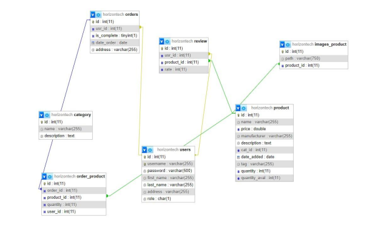

## GUI WORK

### Landing Page

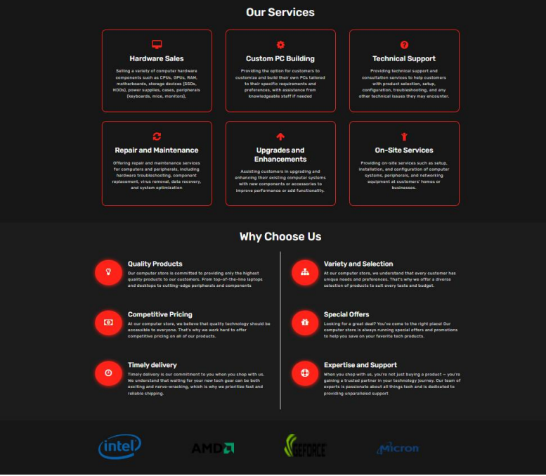
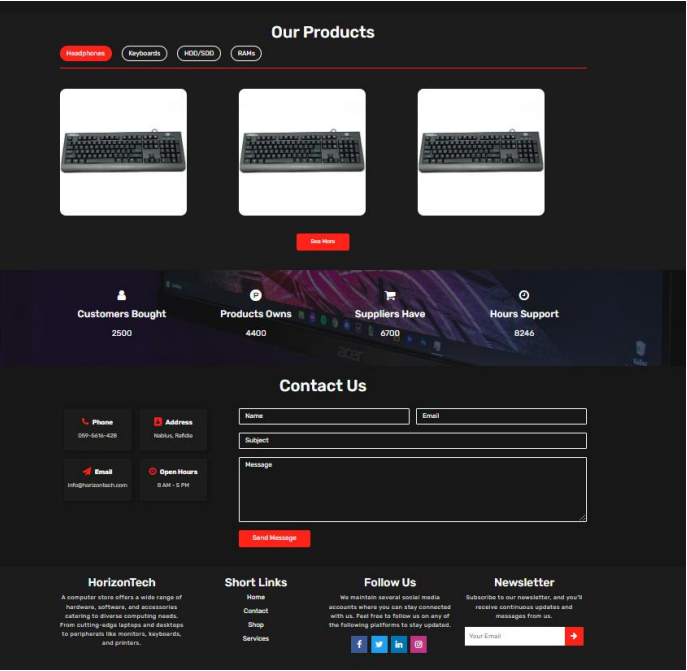

### Shop Page

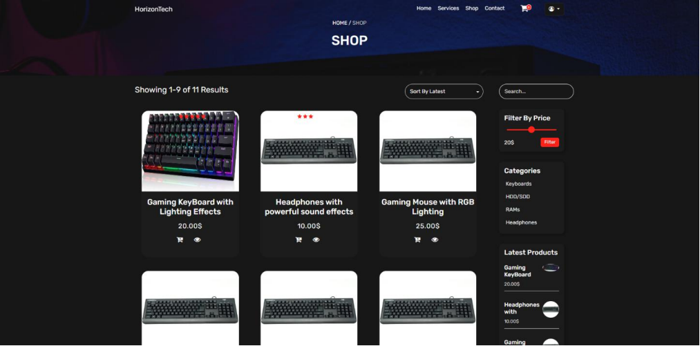
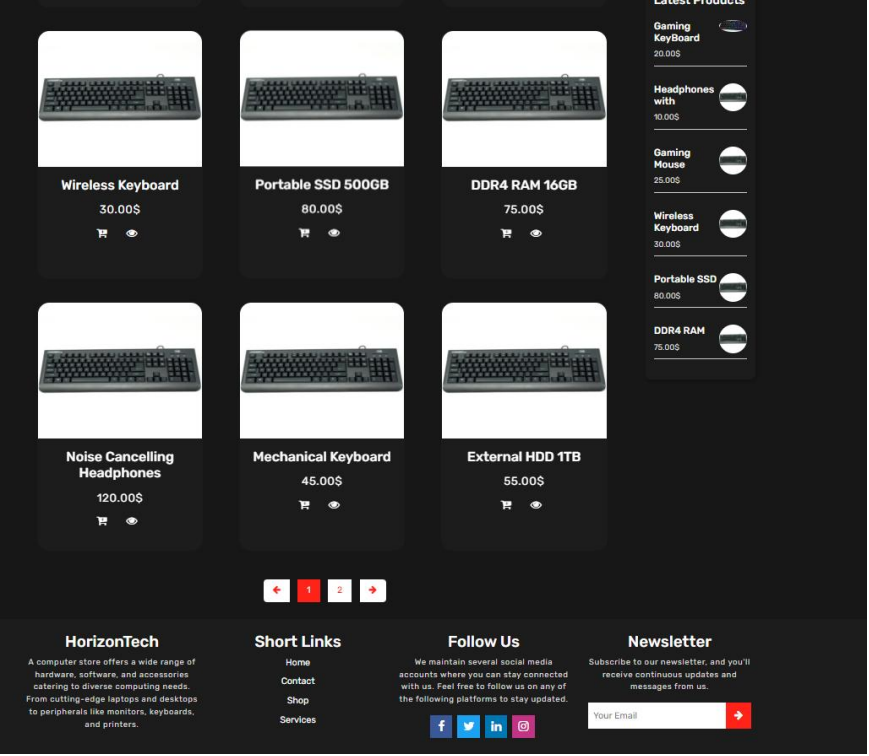

### Product Page

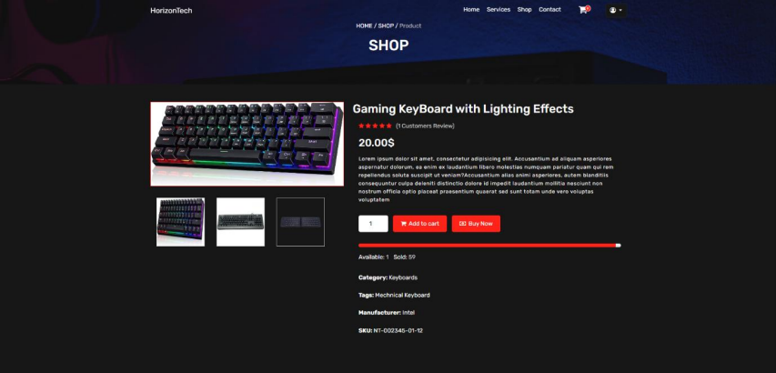
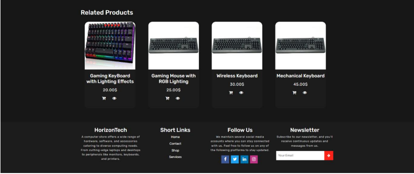

### Shopping Cart

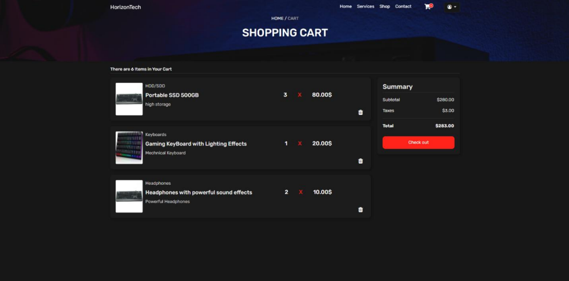

### Checkout

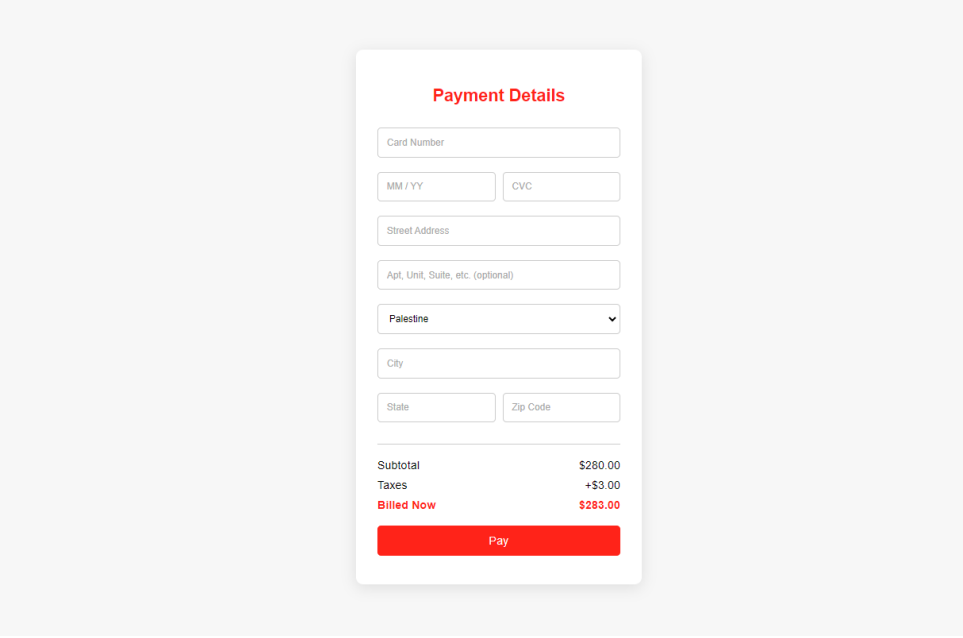

### Orders Page

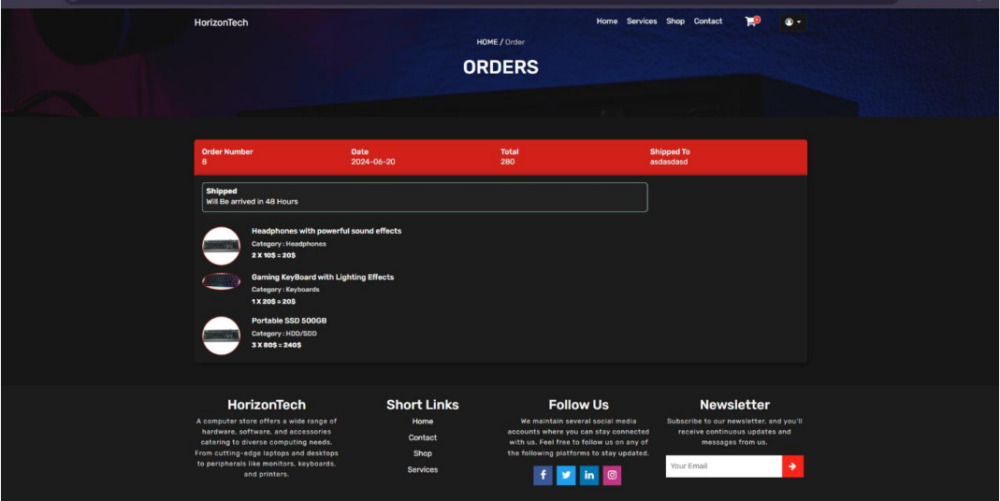

### Dashboard

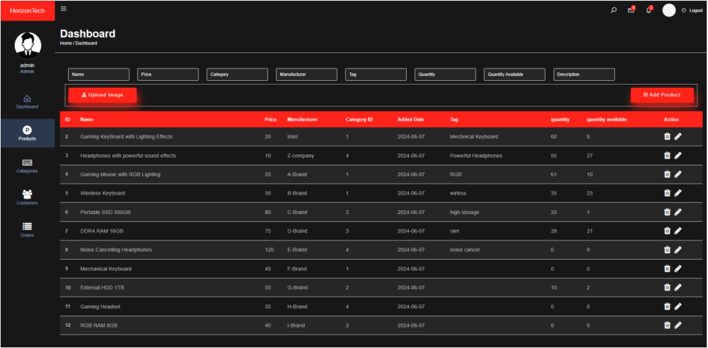
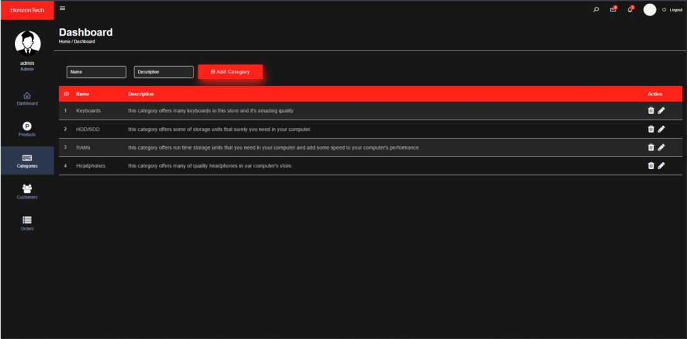
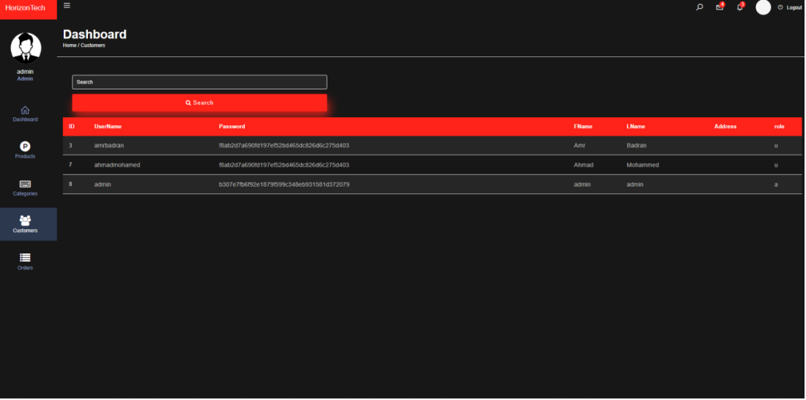
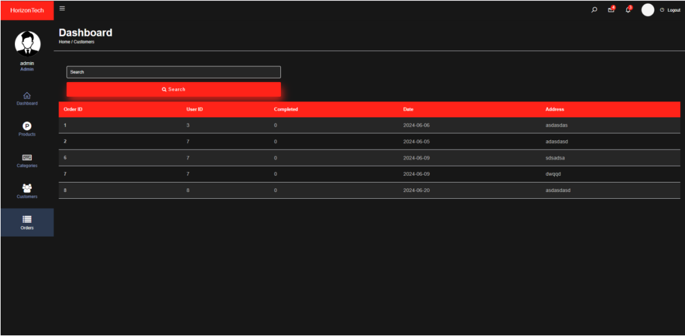

## Conclusion

enhancing the online shopping experience for computer peripherals. By leveraging
a modern tech stack and employing an iterative development approach, we have
successfully crafted a responsive, feature-rich platform. Through user
authentication, real-time data synchronization, and customizable dashboards, we
aimed to empower users with intuitive tools for managing their purchasing journey
effectively.
Throughout this project, our team not only honed our skills in full-stack
development but also demonstrated our commitment to delivering a robust ecommerce solution. As we look ahead, our platform stands as a testament to our
capability to innovate in digital retail, offering a seamless interface for tech
enthusiasts worldwide to discover and acquire high-performance computing
components with confidence.
We are proud to have created a user-centric online store that not only simplifies
product discovery but also fosters informed decision-making through
comprehensive product details and user reviews. With a foundation built on
quality, performance, and user satisfaction, our platform is poised for further
growth and future enhancements in the dynamic landscape of e-commerce.
Join us on our journey to redefine online shopping for computer peripherals, where
efficiency meets excellence, and every click brings you closer to your ideal tech
upgrade
